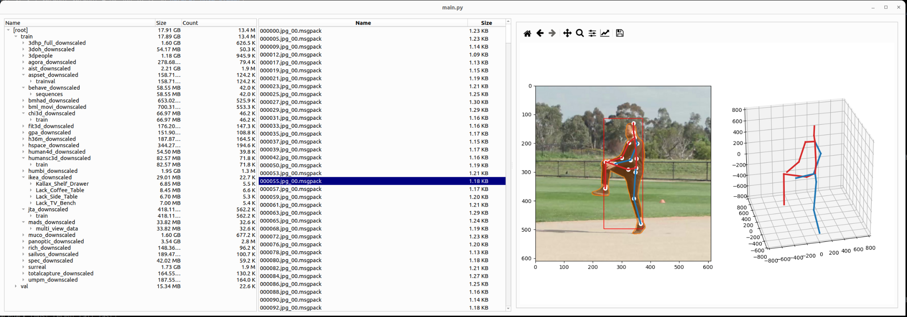

# Pose Dataset Viewer



This is a companion GUI tool for browsing the [PosePile](https://github.com/isarandi/PosePile) dataset collection for 3D human pose estimation.
The images and the annotations need to be stored in the [BareCat](https://github.com/isarandi/BareCat) archive format for this tool.
The individual annotation files in the archive are dictionaries serialized with msgpack-numpy, and the precise dictionary structure is as generated [here](https://github.com/isarandi/PosePile/blob/main/posepile/tools/dataset_pickle_to_barecat.py#L70).

Example run:

```
python -m pose_dataset_viewer.main --images=/path/to/images.barecat --annotations=/path/to/annotations.barecat
```

Qt6 needs to be installed.
